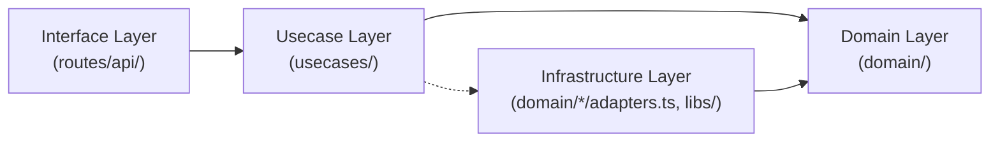

# Design Document

Tanks向けバックエンドAPIのDesign Document。

## 目次

1. [概要](#概要)
2. [技術スタック](#技術スタック)
3. [アーキテクチャ](#アーキテクチャ)
4. [データベース設計](#データベース設計)
5. [認証設計](#認証設計)
6. [ランキング機能設計](#ランキング機能設計)
7. [バリデーション設計](#バリデーション設計)
8. [API設計](#api設計)
9. [設定値](#設定値)
10. [Clean Architecture準拠ガイドライン](#clean-architecture準拠ガイドライン)

---

## 概要

ユーザー管理、認証、対戦記録、ランキング機能を提供するバックエンドAPI。

### 主要機能

| 機能         | 説明                                                        |
| ------------ | ----------------------------------------------------------- |
| ユーザー管理 | 作成、情報取得、名前変更                                    |
| 認証         | トークンベース認証（アクセストークン/リフレッシュトークン） |
| 対戦記録     | 勝敗の記録と戦績管理                                        |
| ランキング   | 勝率に基づくTOP10ランキング                                 |

---

## 技術スタック

| カテゴリ       | 技術                | 採用理由                                     |
| -------------- | ------------------- | -------------------------------------------- |
| ランタイム     | Bun                 | 高速、SQLite組み込み、TypeScript標準サポート |
| フレームワーク | Hono                | 軽量、型安全、ミドルウェアが充実             |
| ORM            | Drizzle             | 型安全、軽量、SQLライク、ウィンドウ関数対応  |
| DB             | SQLite (bun:sqlite) | 外部依存なし、Bunネイティブで高速            |
| バリデーション | Zod                 | 型推論が強力、Honoと相性良い                 |
| OpenAPI        | @hono/zod-openapi   | Zodスキーマから自動生成                      |
| テスト         | bun:test            | Bun標準、高速                                |

---

## アーキテクチャ

Clean Architectureに基づいた4層構造。

### レイヤー構成



| レイヤー       | 責務                                                     | 配置                                    |
| -------------- | -------------------------------------------------------- | --------------------------------------- |
| Interface      | リクエストのパース・バリデーション、ユースケース呼び出し | `app/routes/api/`                       |
| Usecase        | ビジネスロジックの実装                                   | `app/usecases/`                         |
| Domain         | エンティティ、抽象リポジトリ定義                         | `app/domain/`                           |
| Infrastructure | Drizzleによるリポジトリ実装                              | `app/domain/*/adapters.ts`, `app/libs/` |

### ディレクトリ構成

- `app/`
  - `domain/` - ドメイン層
    - `user/` - ユーザードメイン
      - `entity.ts` - User, AuthToken 型定義
      - `repository.ts` - 抽象リポジトリ
      - `adapters.ts` - Drizzle実装
      - `validator.ts` - ユーザー名バリデーション
    - `match/` - 対戦ドメイン
      - `entity.ts` - Match 型定義
      - `repository.ts` - 抽象リポジトリ
      - `adapters.ts` - Drizzle実装
    - `ranking/` - ランキングドメイン
      - `entity.ts` - RankedUser 型定義
      - `repository.ts` - 抽象リポジトリ
      - `adapters.ts` - Drizzle実装（ウィンドウ関数）
  - `usecases/` - ユースケース層
    - `repositories-provider.ts` - DI設定
    - `user/` - ユーザー関連ユースケース
    - `match/` - 対戦関連ユースケース
    - `ranking/` - ランキング関連ユースケース
  - `routes/api/` - APIルート（インターフェース層）
  - `schemas/` - Zodスキーマ（OpenAPI用）
  - `helpers/` - ヘルパー（認証など）
  - `libs/` - DB、キャッシュ

---

## データベース設計

### テーブル一覧

#### users

| カラム     | 型      | 説明                               |
| ---------- | ------- | ---------------------------------- |
| id         | INTEGER | 主キー（自動採番）                 |
| name       | TEXT    | ユーザー名（デフォルト: 'NoName'） |
| wins       | INTEGER | 勝利数（デフォルト: 0）            |
| losses     | INTEGER | 敗北数（デフォルト: 0）            |
| created_at | TEXT    | 作成日時（ISO 8601）               |
| updated_at | TEXT    | 更新日時（ISO 8601）               |

#### auth_tokens

| カラム                   | 型      | 説明                         |
| ------------------------ | ------- | ---------------------------- |
| id                       | INTEGER | 主キー                       |
| user_id                  | INTEGER | ユーザーID（外部キー）       |
| access_token             | TEXT    | アクセストークン             |
| refresh_token            | TEXT    | リフレッシュトークン         |
| access_token_expires_at  | TEXT    | アクセストークン有効期限     |
| refresh_token_expires_at | TEXT    | リフレッシュトークン有効期限 |
| created_at               | TEXT    | 作成日時                     |

#### matches

| カラム    | 型      | 説明                 |
| --------- | ------- | -------------------- |
| id        | INTEGER | 主キー               |
| winner_id | INTEGER | 勝者のユーザーID     |
| loser_id  | INTEGER | 敗者のユーザーID     |
| played_at | TEXT    | 対戦日時（ISO 8601） |

### インデックス

```sql
-- トークン検証の高速化
CREATE INDEX idx_auth_tokens_access_token ON auth_tokens(access_token);
CREATE INDEX idx_auth_tokens_refresh_token ON auth_tokens(refresh_token);
CREATE INDEX idx_auth_tokens_user_id ON auth_tokens(user_id);

-- ランキング取得の高速化
CREATE INDEX idx_users_wins_losses ON users(wins, losses);

-- 対戦履歴検索用
CREATE INDEX idx_matches_winner_id ON matches(winner_id);
CREATE INDEX idx_matches_loser_id ON matches(loser_id);
CREATE INDEX idx_matches_played_at ON matches(played_at);
```

### 設計判断

| 項目           | 決定                  | 理由                       |
| -------------- | --------------------- | -------------------------- |
| 戦績の保存方式 | usersに集計値を保持   | ランキング取得時のJOIN不要 |
| 勝率計算       | クエリ時に計算        | データ整合性が保たれる     |
| 対戦履歴       | 保存する              | 将来の分析・デバッグ用途   |
| 日時の保存形式 | ISO 8601文字列（UTC） | JSONシリアライズが容易     |

---

## 認証設計

### 方式

ランダムトークン方式（JWTではない）を採用。

| 項目                         | 決定                      | 理由                        |
| ---------------------------- | ------------------------- | --------------------------- |
| トークン形式                 | ランダム文字列            | シンプル、即時無効化可能    |
| 生成方法                     | `crypto.randomUUID()`     | 標準API、十分なエントロピー |
| 保存場所                     | DB（auth_tokensテーブル） | トークン検証・無効化が容易  |
| アクセストークン有効期限     | 1時間                     | セキュリティ確保            |
| リフレッシュトークン有効期限 | 30日                      | ゲームの利用頻度を考慮      |

### 認証フロー

1. ユーザー作成（POST /api/users）で accessToken と refreshToken を取得
2. APIリクエスト時は Authorization: Bearer {accessToken} ヘッダーを付与
3. アクセストークン期限切れ時は POST /api/auth/refresh で新しいトークンを取得
4. 再ログイン時は POST /api/users/login で新しいトークンを取得

---

## ランキング機能設計

### 仕様

| 項目         | 仕様                                  |
| ------------ | ------------------------------------- |
| 対象ユーザー | 10戦以上プレイしたユーザー            |
| 表示内容     | TOP10 + 自分自身                      |
| ソート基準   | 勝率降順 -> 勝ち数降順 -> ID昇順      |
| 圏外表示     | 10戦未満または10位以下は `rank: null` |

### キャッシュ戦略

| 項目           | 決定           | 理由                           |
| -------------- | -------------- | ------------------------------ |
| キャッシュ方式 | インメモリ     | 外部依存を増やさない           |
| キャッシュ単位 | TOP10全体で1つ | 全員共通データ                 |
| TTL            | 30秒           | リアルタイム性と負荷のバランス |

| データ           | キャッシュ | 理由                         |
| ---------------- | ---------- | ---------------------------- |
| TOP10ランキング  | する       | 全ユーザー共通、更新頻度低い |
| 自分の順位・戦績 | しない     | 対戦直後に最新情報を見たい   |

### ランキング取得クエリ

```sql
WITH ranked_users AS (
  SELECT
    id AS user_id,
    name AS user_name,
    wins,
    losses,
    (wins + losses) AS total_matches,
    CASE
      WHEN (wins + losses) = 0 THEN 0.0
      ELSE ROUND(CAST(wins AS REAL) / (wins + losses) * 100, 2)
    END AS win_rate,
    ROW_NUMBER() OVER (
      ORDER BY
        CAST(wins AS REAL) / NULLIF(wins + losses, 0) DESC,
        wins DESC,
        id ASC
    ) AS rank
  FROM users
  WHERE (wins + losses) >= 10
)
SELECT * FROM ranked_users WHERE rank <= 10;
```

### 勝敗判定

| 項目     | 決定                      | 理由                   |
| -------- | ------------------------- | ---------------------- |
| 判定者   | サーバー側                | クライアント改ざん防止 |
| 判定基準 | homeScore vs visitorScore | シンプル               |
| 引き分け | 考慮しない                | 仕様に記載なし         |

---

## バリデーション設計

### ユーザー名ルール

| ルール   | 内容                                                                                             |
| -------- | ------------------------------------------------------------------------------------------------ |
| 文字数   | 3〜15文字（Unicode文字単位）                                                                     |
| 許可文字 | ひらがな、カタカナ、漢字、英数字（半角・全角）、スペース（半角・全角）、長音符（ー）、中点（・） |
| 禁止文字 | 記号、絵文字                                                                                     |

### 対戦バリデーション

- 自分自身との対戦は不可（`SELF_MATCH_NOT_ALLOWED`）
- 対戦相手の存在確認（`VISITOR_NOT_FOUND`）

---

## API設計

### エンドポイント一覧

| メソッド | パス                | 認証 | 説明                 |
| -------- | ------------------- | :--: | -------------------- |
| POST     | /api/users          |  -   | ユーザー新規作成     |
| POST     | /api/users/login    |  -   | ログイン             |
| GET      | /api/users/:id      | 必要 | ユーザー情報取得     |
| PATCH    | /api/users/:id/name | 必要 | ユーザー名変更       |
| POST     | /api/auth/refresh   |  -   | トークンリフレッシュ |
| POST     | /api/matches        | 必要 | 対戦結果を記録       |
| GET      | /api/rankings       | 必要 | ランキング取得       |

### エラーコード一覧

| コード                  | HTTPステータス | 説明                       |
| ----------------------- | -------------- | -------------------------- |
| UNAUTHORIZED            | 401            | アクセストークンが無効     |
| INVALID_REFRESH_TOKEN   | 401            | リフレッシュトークンが無効 |
| FORBIDDEN               | 403            | 権限がない                 |
| USER_NOT_FOUND          | 404            | ユーザーが存在しない       |
| VISITOR_NOT_FOUND       | 404            | 対戦相手が存在しない       |
| INVALID_NAME_LENGTH     | 400            | 名前の長さが不正           |
| INVALID_NAME_CHARACTERS | 400            | 名前に不正な文字           |
| SELF_MATCH_NOT_ALLOWED  | 400            | 自分自身との対戦           |
| VALIDATION_ERROR        | 400            | リクエストボディが不正     |
| INTERNAL_ERROR          | 500            | サーバー内部エラー         |

---

## 設定値

```typescript
export const config = {
  db: {
    path: process.env.DATABASE_PATH ?? "./data/app.db",
  },
  auth: {
    accessTokenExpiresIn: 60 * 60 * 1000, // 1時間
    refreshTokenExpiresIn: 30 * 24 * 60 * 60 * 1000, // 30日
  },
  user: {
    defaultName: "NoName",
    nameMinLength: 3,
    nameMaxLength: 15,
  },
  ranking: {
    minMatchesForRanking: 10, // ランキング表示に必要な最低対戦数
    topRanksCount: 10, // TOP何位まで表示するか
    cacheTtlMs: 30_000, // キャッシュTTL（30秒）
  },
} as const
```

---

## Clean Architecture準拠ガイドライン

### 各レイヤーのimport許可ルール

| ファイル                 | import可能な対象                                                                           |
| ------------------------ | ------------------------------------------------------------------------------------------ |
| `domain/*/entity.ts`     | なし（純粋な型定義のみ）                                                                   |
| `domain/*/repository.ts` | `entity.ts` のみ                                                                           |
| `domain/*/adapters.ts`   | `entity.ts`, `repository.ts`, `libs/db/*`                                                  |
| `domain/*/validator.ts`  | `entity.ts` のみ                                                                           |
| `usecases/*/*.ts`        | `domain/*/entity.ts`, `domain/*/repository.ts`, `repositories-provider.ts`, `libs/cache/*` |
| `routes/api/*.ts`        | `usecases/*/*.ts`, `schemas/*.ts`, `helpers/*`                                             |
| `schemas/*.ts`           | Zod のみ                                                                                   |
| `libs/db/*.ts`           | Drizzle, bun:sqlite                                                                        |

### 注意点

1. EntityとORMスキーマの分離
   - ドメインエンティティはPlain Objectであるべき
   - Drizzleの型（`$inferSelect`等）をドメイン型として使わない

2. 境界を越えるデータの扱い
   - HonoのContextをユースケースに渡さない
   - Drizzleの行データをそのままレスポンスとして返さない

3. 依存性注入
   - リポジトリのインスタンス化は`repositories-provider.ts`で一元管理
   - ユースケース内で`createXxxRepository()`を呼ばない

### 実装時チェックリスト

- `domain/*/entity.ts` に `import` 文がないか
- ユースケースがHonoの`Context`を受け取っていないか
- ユースケース内で`createXxxRepository()`を呼んでいないか
- `adapters.ts`が`entity.ts`をimportしているか（逆になっていないか）
- レスポンスにDrizzleの行データをそのまま返していないか

---

## 未決定事項・今後の検討

| 項目                           | 状態   | メモ                   |
| ------------------------------ | ------ | ---------------------- |
| トークンのクリーンアップバッチ | 未実装 | 将来的に実装検討       |
| レート制限                     | 未実装 | 必要に応じて追加       |
| 引き分けの扱い                 | 未定   | 必要になれば追加       |
| 対戦履歴の保持期間             | 無期限 | 将来的にアーカイブ検討 |
