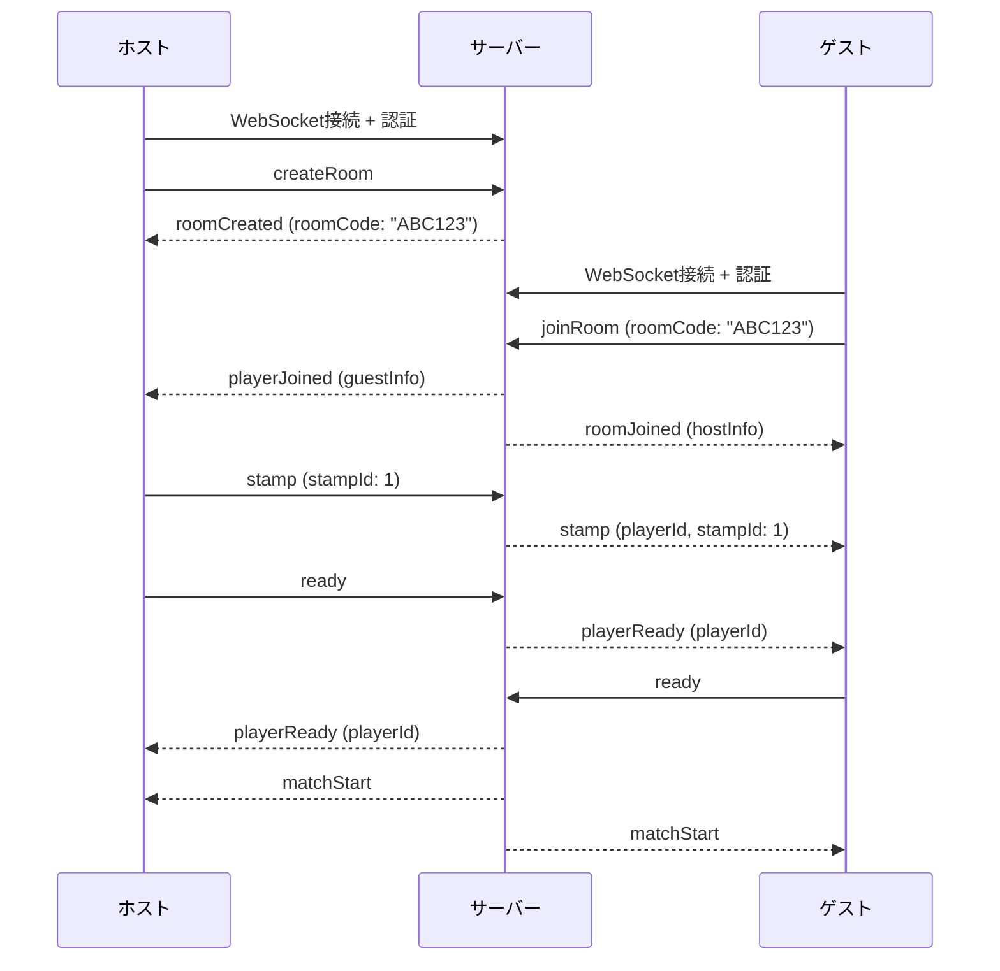

# PvP機能 設計ドキュメント

Tanks向けネットワーク対戦（PvP）機能の設計ドキュメント。

## 目次

1. [概要](#概要)
2. [ロビー機能](#ロビー機能)
3. [通信設計](#通信設計)
4. [データベース設計](#データベース設計)
5. [WebSocketメッセージ仕様](#websocketメッセージ仕様)
6. [実装計画](#実装計画)

---

## 概要

### 機能一覧

| 機能                 | 説明                                             |
| -------------------- | ------------------------------------------------ |
| ロビー機能           | ルームコード方式のマッチング、スタンプ、準備完了 |
| ネットワーク対戦機能 | リアルタイムゲーム同期（将来実装）               |

### 技術方針

| 項目           | 決定             | 理由                                          |
| -------------- | ---------------- | --------------------------------------------- |
| 通信方式       | WebSocket        | 双方向リアルタイム通信、Bunネイティブサポート |
| マッチング方式 | ルームコード方式 | 友人同士で対戦しやすい、サーバー負荷低い      |
| ルーム管理     | インメモリ       | シンプル、1サーバー想定、永続化不要           |

---

## ロビー機能

### 画面遷移

```
ホーム画面 --[Versus Player]--> ロビー画面 --[双方READY]--> 対戦画面
    ^                              |
    +------[退室ボタン]------------+
```

### ルームコード方式

1. **ホスト**: ルームを作成し、6桁のルームコードを取得
2. **ゲスト**: ルームコードを入力してルームに参加
3. **マッチング成立**: 2人揃ったらロビー画面へ

#### ルームコード仕様

| 項目     | 仕様                             |
| -------- | -------------------------------- |
| 形式     | 英数字6文字（大文字、0-9）       |
| 例       | `ABC123`, `X7K9M2`               |
| 生成方式 | ランダム生成、衝突時は再生成     |
| 有効期限 | ルーム作成から30分、または使用後 |

### スタンプ機能

- 6種類のスタンプを選択可能
- 押下すると自分の表示エリアに表示、相手に通知
- 5秒後にフェードアウト
- フェードアウト前に新スタンプを押すと上書き

#### スタンプ種類

| ID  | 名前       | 意味       |
| --- | ---------- | ---------- |
| 1   | `greeting` | よろしく   |
| 2   | `good`     | ナイス     |
| 3   | `think`    | うーん     |
| 4   | `hurry`    | 急いで     |
| 5   | `sorry`    | ごめん     |
| 6   | `thanks`   | ありがとう |

### 準備完了機能

- プレイヤーが「READY」ボタンを押すと準備完了状態になる
- 相手に通知される
- 双方が準備完了になると対戦画面へ遷移

---

## 通信設計

### アーキテクチャ

```
クライアント  <--WebSocket-->  バックエンド
                                  |
                                  +-- ルームマネージャー（インメモリ）
                                  +-- プレイヤー接続管理
```

### WebSocket接続フロー



### 認証方式

WebSocket接続時にアクセストークンを検証する。

| 項目     | 仕様                                          |
| -------- | --------------------------------------------- |
| 認証方法 | URL クエリパラメータ `?token={accessToken}`   |
| 検証     | 既存の`AuthTokenRepository`を使用             |
| 失敗時   | WebSocket接続を拒否（1008: Policy Violation） |

**接続URL例:**

```
ws://localhost:3000/ws?token=xxxxxxxx-xxxx-xxxx-xxxx-xxxxxxxxxxxx
```

---

## データベース設計

### 新規テーブル

ロビー機能ではデータベースを使用しない（インメモリ管理）。

**理由:**

- ルームは一時的なもので永続化不要
- 対戦結果は既存の`matches`テーブルに記録
- サーバー再起動時はルームがリセットされても問題ない

### インメモリデータ構造

```typescript
// ルーム
interface Room {
  code: string // ルームコード
  hostId: number // ホストのユーザーID
  guestId: number | null // ゲストのユーザーID
  hostReady: boolean
  guestReady: boolean
  createdAt: Date
  expiresAt: Date
}

// プレイヤー接続
interface PlayerConnection {
  ws: WebSocket
  userId: number
  roomCode: string | null
}
```

---

## WebSocketメッセージ仕様

### メッセージフォーマット

```typescript
// クライアント → サーバー
interface ClientMessage {
  type: string
  payload?: unknown
}

// サーバー → クライアント
interface ServerMessage {
  type: string
  payload?: unknown
  error?: {
    code: string
    message: string
  }
}
```

### クライアント → サーバー

#### createRoom

ルームを作成する。

```json
{
  "type": "createRoom"
}
```

#### joinRoom

ルームに参加する。

```json
{
  "type": "joinRoom",
  "payload": {
    "roomCode": "ABC123"
  }
}
```

#### leaveRoom

ルームから退出する。

```json
{
  "type": "leaveRoom"
}
```

#### stamp

スタンプを送信する。

```json
{
  "type": "stamp",
  "payload": {
    "stampId": 1
  }
}
```

#### ready

準備完了を通知する。

```json
{
  "type": "ready"
}
```

#### cancelReady

準備完了を取り消す。

```json
{
  "type": "cancelReady"
}
```

### サーバー → クライアント

#### roomCreated

ルーム作成成功。

```json
{
  "type": "roomCreated",
  "payload": {
    "roomCode": "ABC123"
  }
}
```

#### roomJoined

ルーム参加成功。

```json
{
  "type": "roomJoined",
  "payload": {
    "roomCode": "ABC123",
    "opponent": {
      "id": 1,
      "name": "Player1"
    }
  }
}
```

#### playerJoined

相手がルームに参加した。

```json
{
  "type": "playerJoined",
  "payload": {
    "opponent": {
      "id": 2,
      "name": "Player2"
    }
  }
}
```

#### playerLeft

相手がルームから退出した。

```json
{
  "type": "playerLeft"
}
```

#### stamp

スタンプを受信した。

```json
{
  "type": "stamp",
  "payload": {
    "playerId": 2,
    "stampId": 1
  }
}
```

#### playerReady

相手が準備完了した。

```json
{
  "type": "playerReady",
  "payload": {
    "playerId": 2
  }
}
```

#### playerCancelReady

相手が準備完了を取り消した。

```json
{
  "type": "playerCancelReady",
  "payload": {
    "playerId": 2
  }
}
```

#### matchStart

対戦開始（双方READY）。

```json
{
  "type": "matchStart",
  "payload": {
    "roomCode": "ABC123",
    "players": [
      { "id": 1, "name": "Player1", "role": "host" },
      { "id": 2, "name": "Player2", "role": "guest" }
    ]
  }
}
```

### エラーコード

| コード             | 説明                               |
| ------------------ | ---------------------------------- |
| `ROOM_NOT_FOUND`   | 指定されたルームコードが存在しない |
| `ROOM_FULL`        | ルームが満員（2人）                |
| `ROOM_EXPIRED`     | ルームの有効期限切れ               |
| `ALREADY_IN_ROOM`  | すでに別のルームに参加中           |
| `NOT_IN_ROOM`      | ルームに参加していない             |
| `INVALID_STAMP_ID` | 無効なスタンプID                   |

---

## 実装計画

### Phase 1: ロビー機能

#### 1.1 WebSocket基盤

- [x] Bun.serveでWebSocketサポート追加
- [x] 認証ミドルウェア（トークン検証）
- [x] 接続管理（PlayerConnection）

#### 1.2 ルーム管理

- [x] ルームマネージャー実装
- [x] ルームコード生成
- [x] ルーム作成/参加/退出

#### 1.3 ロビー機能

- [x] スタンプ送受信
- [x] 準備完了/取り消し
- [x] マッチスタート判定

#### 1.4 テスト

- [x] ユニットテスト（ルーム管理）
- [x] 統合テスト（WebSocket通信）

### Phase 2: ネットワーク対戦機能（将来）

- [ ] ゲーム状態同期
- [ ] 当たり判定
- [ ] ラウンド管理
- [ ] 勝敗記録

---

## Clean Architecture準拠

### ディレクトリ構成（案）

```
app/
  domain/
    lobby/
      entity.ts       # Room, PlayerConnection型
      repository.ts   # 抽象インターフェース
      adapters.ts     # インメモリ実装
  usecases/
    lobby/
      create-room.ts
      join-room.ts
      leave-room.ts
      send-stamp.ts
      set-ready.ts
  routes/
    ws/
      index.ts        # WebSocketハンドラー
      handlers.ts     # メッセージハンドラー
```

### レイヤー間の依存

| ファイル                     | import可能な対象                                                                   |
| ---------------------------- | ---------------------------------------------------------------------------------- |
| `domain/lobby/entity.ts`     | なし                                                                               |
| `domain/lobby/repository.ts` | `entity.ts` のみ                                                                   |
| `domain/lobby/adapters.ts`   | `entity.ts`, `repository.ts`                                                       |
| `usecases/lobby/*.ts`        | `domain/lobby/entity.ts`, `domain/lobby/repository.ts`, `repositories-provider.ts` |
| `routes/ws/*.ts`             | `usecases/lobby/*.ts`, `helpers/*`                                                 |

---

## 設定値（案）

```typescript
export const pvpConfig = {
  room: {
    codeLength: 6, // ルームコード長
    expiresIn: 30 * 60 * 1000, // ルーム有効期限（30分）
    maxPlayers: 2, // 最大プレイヤー数
  },
  stamp: {
    count: 6, // スタンプ種類数
    fadeOutMs: 5000, // フェードアウト時間
  },
  websocket: {
    path: "/ws", // WebSocketパス
    pingInterval: 30_000, // Ping間隔（30秒）
  },
} as const
```

---

## 未決定事項・検討項目

| 項目           | 状態 | メモ                             |
| -------------- | ---- | -------------------------------- |
| 切断時の再接続 | 未定 | 一定時間内なら再接続可能にするか |
| ルーム一覧表示 | 未定 | 現時点ではルームコード入力のみ   |
| 観戦機能       | 未定 | 将来検討                         |
| レート制限     | 未定 | スタンプ連打対策                 |
