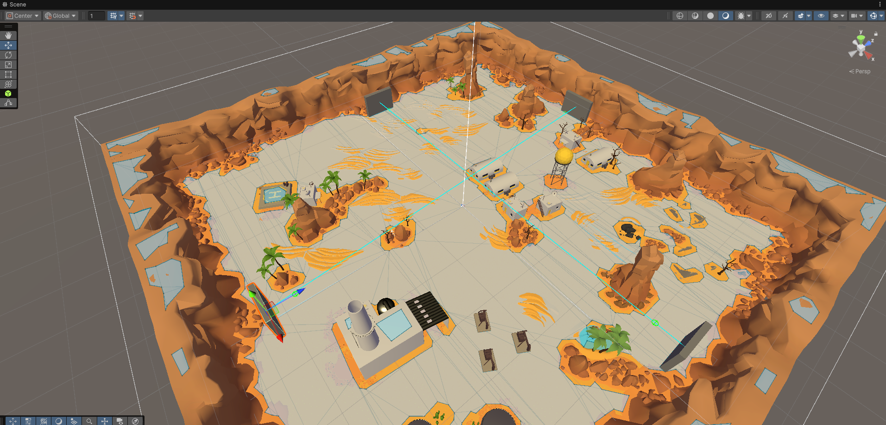

## 基本課題の実装 / ワームホールの実装

- 工夫した点：
  - ゲームバランスに関わる部分はパラメータ化することで、
    後から調整できるようにした

  - 適切な粒度でテストを実装することで、
    変更に強い設計を目指した

  - エディタ上では対応するワームホールを線で結んで表示することで、
    配置をわかりやすくした

    

プレイ映像：

https://tus.box.com/s/qpiwd60veuwvr83g47x2bo50xg9l18um

---

## 応用課題の実装 / ログイン機能の実装（フロントエンド）

- 工夫した点：

  - バックエンドはOpenAPIで定義されているため、
    それからOpenAPI Generatorでクライアントを自動生成することで、
    安全なAPI呼び出しを実現した

  - MVPアーキテクチャに基づいて実装することで、
    UIロジックとビジネスロジックを分離し、保守性を向上させた

プレイ映像：

https://tus.box.com/s/qxoa2sfjv87v17ozx7c8g0hysj6qfvlh
